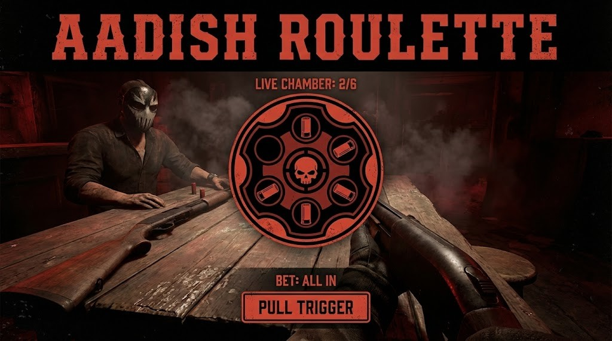

<div align="center">

# 🎯 AADISH ROULETTE


### A Deadly Game of Chance

[](https://aadishroulette.vercel.app/)
[](https://github.com/AadishY)

---



*A high-stakes tabletop horror game where you play Russian Roulette with a 12-gauge pump-action shotgun.*

</div>

---

## 🎬 About

**Aadish Roulette** is a web-based reimagining of the deadly shotgun game, inspired by Mike Klubnika's *Buckshot Roulette*. Built with React and Three.js, it features stunning 3D visuals, atmospheric effects, and intense strategic gameplay.

### Key Features

| Feature | Description |
|---------|-------------|
| 🎮 **3D Environment** | Fully interactive table, gun, and dealer using Three.js |
| 🌟 **Atmospheric Visuals** | Dynamic lighting, dust particles, CRT effects, volumetric fog |
| 🤖 **Smart AI** | Dealer remembers revealed shells and uses items strategically |
| 🌐 **Multiplayer** | Play against real opponents online |
| 📱 **Mobile Ready** | Optimized for Android and iOS (landscape mode) |

---

## 🔧 Item System

Use items strategically to gain an advantage:

| Item | Effect |
|------|--------|
| 🔍 **Magnifying Glass** | Reveals the current shell in the chamber |
| 🍺 **Beer** | Ejects the current shell without firing |
| 🚬 **Cigarettes** | Restores 1 HP |
| 🔗 **Handcuffs** | Skips opponent's next turn |
| ✂️ **Hand Saw** | Doubles damage of next shot (2 damage) |
| 📞 **Burner Phone** | Reveals a random future shell position |
| 🔄 **Inverter** | Swaps current shell (LIVE ↔ BLANK) |
| 💉 **Adrenaline** | Steal and immediately use opponent's item |

---

## 🎮 How to Play

1. **Take Turns** - You and the dealer alternate turns
2. **Grab the Gun** - Pick up the shotgun when it's your turn
3. **Choose Your Target** - Shoot opponent (1 damage if LIVE) or yourself (if BLANK, get extra turn!)
4. **Use Items** - Strategic item use before shooting can change everything
5. **Survive** - Reduce opponent's HP to zero to win!

### Controls

- **Mouse/Touch** - Aim and interact with UI
- **Landscape Mode** - Required for mobile devices
- **Fullscreen** - Recommended for best experience

---

## 🛠️ Installation & Development

This project uses [Vite](https://vitejs.dev/) + [React](https://react.dev/) + [Three.js](https://threejs.org/).

### Prerequisites

- Node.js 18+ 
- npm or yarn

### Quick Start

```bash
# Clone the repository
git clone https://github.com/AadishY/Aadish-Roulette.git
cd Aadish-Roulette

# Install dependencies
npm install

# Run development server
npm run dev

# Build for production
npm run build
```

The development server runs at `http://localhost:5173`

---

## 🚀 Tech Stack

<div align="center">


</div>

---

## 📁 Project Structure

```
AadishRoulette/
├── components/          # React components
│   ├── ui/             # UI components (buttons, overlays, etc.)
│   ├── ThreeScene.tsx  # 3D scene and rendering
│   ├── GameUI.tsx      # Main game interface
│   └── TutorialGuide.tsx # Tutorial carousel
├── hooks/              # Custom React hooks
│   ├── useGameLogic.ts # Single-player game logic
│   ├── useDealerAI.ts  # AI opponent logic
│   └── useSocket.ts    # Multiplayer connection
├── utils/              # Utility functions
├── image/              # Assets (favicon, preview images)
├── App.tsx             # Main application
├── index.html          # Entry HTML with SEO
└── server.js           # Multiplayer server
```

---

## 🌐 Deployment

### Vercel (Recommended)

[](https://vercel.com/new/clone?repository-url=https://github.com/AadishY/Aadish-Roulette)

### Manual Deployment

```bash
npm run build
# Deploy the 'dist' folder to your hosting provider
```

---

## 📜 Credits

- **Original Game Concept**: [Mike Klubnika](https://mikeklubnika.itch.io/) (Buckshot Roulette)
- **Web Development**: [Aadish](https://github.com/AadishY)
- **Technologies**: React, Three.js, Lucide Icons, TailwindCSS, Socket.io

---

## 📄 License

This project is for educational and entertainment purposes. The original Buckshot Roulette game concept belongs to Mike Klubnika.

---

<div align="center">

**Made with ❤️ by [Aadish](https://github.com/AadishY)**

*Version 1.0.4 • 2024*

[](https://github.com/AadishY/Aadish-Roulette)

</div>
